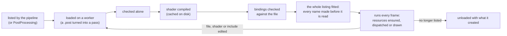

# Passes

One step of the render pipeline each, as data. A `.pass` file says what its shader is, what it reads, writes and
creates, and how often it runs; a [pipeline](../Pipelines/README.md) lists passes in stages; the renderer
(DeferredRenderer) loads, checks, compiles and runs them. A `.post` is the simple case: a fullscreen effect over the
finished image, listed by the world's `PostProcessing` component instead of the pipeline.

```
Passes/
  Core/            The engine's passes, the ones Default.pipeline lists (ids 10100–10192)
  Tonemap.post     Hdr -> Ldr (10030)
  Vignette.post    darkens the edges of Ldr (10031)
```

How the shaders are written (bindings, `PassParams`, the frame block, style) is in the
[Shaders README](../Shaders/README.md); this file is about the asset.

## Lifetime



- A pass is loaded while something lists it and unloaded, with every resource it created, when nothing does.
- While a pass loads or compiles, the frame keeps running without it; what reads what it makes waits.
- A pass that fails any check is **disabled**: one error is logged and the image shows a magenta band with its
  name along the top. Everything after it that reads what it would have made is skipped, quietly. Fix the file and
  it reloads.
- Editing a `.pass`, its shader or any header the shader includes reloads it live.

## A `.pass` file

```json
{
    "kind": "compute",
    "shader": { "id": 8260596084233995265 },
    "creates": [ { "name": "AoRaw", "kind": "texture", "format": "rgba16_float", "scale": 0.5 } ],
    "reads": [ { "name": "Depth", "filter": "nearest" }, { "name": "Normal", "filter": "nearest" } ],
    "writes": [ { "name": "AoRaw" } ],
    "dispatch": { "per": "view", "tile": 16 },
    "params": { "radius": { "x": 1 }, "steps": { "x": 4 } },
    "group": "Lighting/Ambient occlusion",
    "tuning": { "radius": { "label": "Radius (m)", "min": 0.1, "max": 5 } }
}
```

That is `Core/Gtao.pass`: a compute pass that makes a half-resolution texture, reads the depth and normals, writes
the texture, and runs one group per 16-pixel tile of the view.

### Top level

| Field | Default | What it is |
| --- | --- | --- |
| `kind` | `compute` | `compute`, `fullscreen`, `draw` or `quads`. |
| `shader` | none | `{ "id" }` of the compute or fragment shader; for a depth draw or quads, the vertex shader. |
| `fragment` | none | The fragment shader of a depth draw or quads pass. |
| `defines` | `[]` | Whole `#define NAME value` lines put in front of the shader. |
| `each` | `{ "over": "count", "max": 1 }` | Run several times a frame: `max` times (`over: count`), or once per brick job (`over: bricks`), at most `max` (1–64). The shader reads the iteration with `PassIteration()`. |
| `needs` | none | A `$count` the pass runs only for: when it is 0 the pass, what it creates and everything that reads that are left out this frame. |
| `reads` | `[]` | What it reads, **in binding order** (below). |
| `writes` | `[]` | What it writes, **in binding order**. |
| `creates` | `[]` | Resources it makes for itself and every pass after it. |
| `dispatch` | — | How many groups a compute pass dispatches. |
| `draw` | — | What a draw or quads pass draws into and with. |
| `params` | `{}` | Values for the shader's `struct PassParams`, by member name, as `{ "x": … }` (see Materials for the forms). |
| `group` | the stage's | Where the settings window (F4) shows the params: `"Tab/Header"`. |
| `tuning` | `{}` | How the settings window shows each param: `group`, `label`, `description`, `min`, `max`, `fixed` (shown, not editable). Nothing here reaches the shader. |

### Kinds

| Kind | `shader` | `fragment` | Runs |
| --- | --- | --- | --- |
| `compute` | `.comp.hlsl` | — | as `dispatch` says. Must write something. |
| `fullscreen` | `.frag.hlsl` | — | one triangle over the one texture it writes. |
| `draw` with `"pipeline": "depth"` | `.vert.hlsl` | `.frag.hlsl` | the pass's own depth-only pipeline over the culled meshes (shadow maps). |
| `draw` with a material pipeline | none | none | every material class's pipeline, composed by the engine around the surface shaders. |
| `quads` | `.vert.hlsl` | `.frag.hlsl` | six vertices per row of `draw.rows`, from the vertex id (glows, clearing atlas tiles). |

Draws are allowed in the shadows, scene and transparency stages; quads in the scene and shadows stages.

### `reads` and `writes`

```json
"reads":  [ { "name": "Depth", "filter": "nearest" }, { "name": "Lights" } ],
"writes": [ { "name": "Hdr" }, { "name": "BrickAtlas", "level": 2, "layer": 0, "load": "clear" } ]
```

- A read is `name` and, for a texture, `filter`: `default` (nearest for depth and single-float textures, linear
  otherwise), `nearest`, `linear`, or `comparison` for a shadow map read with `SampleCmpLevelZero`.
- A write is `name`, and for a texture the mip `level` and `layer` (or 3D slice), and for a fullscreen pass's target
  what is done with what was there: `load` is `dont_care` (default), `load` or `clear`.
- `<Name>Previous` reads last frame's copy of a created buffer marked `history`.

### `creates`

| Field | Default | What it is |
| --- | --- | --- |
| `name` | — | Must not be an engine name, nor end in `Previous`. |
| `kind` | `texture` | `texture`, `volume` (a 3D texture, `levels` slabs stacked along its depth) or `buffer`. |
| `format` | — | `rgba8_srgb`, `rgba8_unorm`, `rgba16_float`, `r16_float`, `r32_float`, `rg16_float`, `b10_g11_r11_float`, `r8_unorm`, `r32_uint`, `rgba32_float`, or `depth` (the device's depth format). |
| `scale` | 1 | Of the render target's size. 0 means `size` is fixed. |
| `size` | `[]` | A fixed texture's width and height, or one slab of a volume: width, height, depth. |
| `levels` | 1 | Slabs of a volume. |
| `bytes` | — | A buffer's fixed size. |
| `per` | — | Or a `$count` the buffer holds that many rows of, `stride` bytes each (default 4), plus `plus` bytes, never under `min` (16). Exactly one of `bytes` and `per`. |
| `slots` | 1 | Copies of that, for a pass that runs several times over its own slice. |
| `usage` | `storage` | `storage`, `indirect` (draw or dispatch arguments) or `vertex` (bound as an instance-rate vertex buffer by the draws). |
| `seed` | — | An engine buffer copied into this one every frame before anything runs. |
| `reset` | `[]` | Words written at the start of the buffer every frame: numbers or `$counts`. |
| `zero` | false | Zero-filled whenever it is made. |
| `history` | false | Kept twice and swapped every frame: `Name` is this frame's, `NamePrevious` last frame's. |

A created resource lives as long as the pass that creates it is listed, and is made again when its size changes
(the window resized, a count grew).

### `dispatch` (compute)

Exactly one of:

| Form | Groups |
| --- | --- |
| `"per": "view"` | Enough threads to cover the view's rectangle; with `tile`, one group per `tile`-pixel square instead, `depth` groups deep. |
| `"per": "output:Name"` | Enough threads for every texel of a texture or volume it writes. |
| `"per": "level:Name"` | The same for one slab of a volume. |
| `"per": "$count"` | One thread per counted thing. |
| `"groups": [x, y, z]` | Fixed. |
| `"indirect": "Name"` | Read from a buffer at `iteration * indirectStride`. |

### `draw` (draw and quads)

| Field | Default | What it is |
| --- | --- | --- |
| `pipeline` | `material` | `material` (opaque material pipelines), `forward` (transparent, lit as drawn), `refractive` (transparent surfaces that read the scene behind them, after the others), or `depth` (the pass's own depth-only pipeline). |
| `layers` | `all` | Which transparent layers a forward or refractive draw draws: `all`, `depth` (only the nearest's depth), `behind` (those behind it), `nearest`. |
| `colors` | `[]` | Colour targets in `SV_Target` order, at most 4. None for depth only. |
| `depth` | — | The depth target. |
| `load` | `load` | What is done with what the targets held: `load`, `clear` or `dont_care`. |
| `args` | — | The indirect draw buffer the culling filled (one chunk per draw; in the shadows stage one slice per iteration). |
| `instances` | — | The instance-id vertex buffer the culling filled. |
| `impostors` | false | For a depth draw: draw only the impostor cards (a model's last LOD). Without it, everything but them. |
| `depthBiasSlope`, `depthBiasClamp` | 0 | Shadow bias; the clamp keeps an edge-on wall from pushing its depth past the floor. |
| `rows` | — | For quads: how many, a `$count` or a number. |
| `depthCompare` | `greater_or_equal` | Reverse-Z. |
| `depthWrite` | true | |

## A `.post` file

```json
{
    "shader": { "id": 10020 },
    "inputs": [ "Hdr" ],
    "output": { "name": "Ldr" },
    "params": { "exposure": { "x": 1.0 } },
    "tuning": { "exposure": { "label": "Exposure", "min": 0.1, "max": 8 } }
}
```

| Field | Default | What it is |
| --- | --- | --- |
| `shader` | — | A `.frag.hlsl` (drawn over the output) or a `.comp.hlsl` (one thread per output texel). |
| `inputs` | `[]` | Names it reads: `Hdr`, `Ldr`, `Depth`, a gbuffer target, or an earlier post's output. |
| `output` | — | `{ "name", "format", "scale": 1 }`: `Ldr`, `Hdr`, or a new texture this post creates. |
| `params`, `group`, `tuning` | | As in a pass. |

The renderer turns a post into a pass: its inputs become reads, its output the one write (created when it is not an
engine name), dispatched per output texel. It writes the shader's header for it: `PASS_OUTPUT_FORMAT`,
`Include/Pass.hlsli`, and each input as a `Texture2D <Name>` with a `<Name>Sampler`, so a post's HLSL starts at its
`PassParams`. Posts are listed by the world's `PostProcessing` component (at most 8), never by a pipeline: see
"Writing a post" in the [Shaders README](../Shaders/README.md#writing-a-post).

## What must agree

A pass is checked in three steps; the first that fails disables it and says why.

**1. The file alone.**
- The kind matches the shader's stage (the table under Kinds).
- `needs`, `per`, `rows` and `reset` name real `$counts`.
- A buffer has exactly one of `bytes` and `per`; `each.max` is 1–64.
- A compute pass writes something; a fullscreen pass writes exactly one texture.

**2. The compiled shader against the file.** Bindings match by **order and kind, not by name**. The compiler
reports how many of each kind the shader uses; they must equal what the file reads and writes:

| The file | The shader declares, in this order |
| --- | --- |
| reads that are textures | `Texture2D … : READ(n)` and a `SamplerState … : SAMPLER(n)` each |
| reads that are storage textures | `RWTexture… : READ(n)` (read-only) |
| reads that are buffers | `StructuredBuffer… : READ(n)` |
| writes that are textures | `RWTexture… : WRITE(n)` |
| writes that are buffers | `RWStructuredBuffer… : WRITE(n)` |

Every read must be **used** by the shader (the compiler strips unused bindings, which would shift the rest). The
shader may name a binding anything; `CullEarly.comp.hlsl` calls the pass's `DrawArgsEarly` just `DrawArgs`. A
depth draw's vertex stage gets one engine buffer before its reads. `struct PassParams` packs to at most 112 bytes
and holds no textures; a param key the struct does not have is a warning.

**3. The whole listing.** Walked in stage order whenever the listing or a pass changes: every name a pass reads or
writes is either an engine resource or created by a pass **earlier** in the listing, within reach of its scope.

| Stages | Scope | Runs |
| --- | --- | --- |
| Shadows, Gi | frame | once a frame |
| Scene, Lighting, Transparency | view | once per camera view of each target |
| Sky, Post | target | once per render target |

A frame-scope resource is visible to every pass after it; a view's to the passes of that view.

### Engine resources

| Name | Kind | Writable by passes |
| --- | --- | --- |
| `Depth`, `Emissive`, `Albedo`, `Normal`, `Material` | gbuffer textures | drawn into by draws |
| `Hdr` | texture: the lit scene, linear | yes |
| `Ldr` | texture: what is shown and screenshotted | yes, by compute; not a draw target |
| `BrickAtlas` | volume: GI occupancy bricks | yes |
| `Lights` | buffer | yes |
| `Instances`, `Xforms`, `Cells`, `Pages`, `DrawTemplate`, `Lods`, `GiGroups`, `Materials`, `GiMaterials`, `Glows`, `MeshVertices`, `MeshIndices`, `Counts`, `BrickJobs`, `BrickArgs` | buffers the CPU keeps | no |

### `$counts`

Numbers the CPU knows each frame, for `needs`, `per`, `rows` and `reset`:

| Count | Is |
| --- | --- |
| `$pageCount`, `$chunkCount`, `$groupCount` | instance pages, draw chunks, draw groups |
| `$instanceHighWater`, `$visibleHighWater` | the most instances there are, and could be visible |
| `$lightCount`, `$glowCount`, `$meshCount` | |
| `$brickJobs` | meshes queued for GI bricks this frame |
| `$hiZFloats` | the depth pyramid's size |
| `$shadowCasters` | anything that casts a shadow |
| `$transparentChunks`, `$refractiveChunks` | transparent draws, and those that refract |
| `$viewWidth`, `$viewHeight`, `$viewTiles` | the view, and its 32-pixel light tiles |
| `$targetWidth`, `$targetHeight` | the render target |

## Settings and presets

A pass's params are settings: the settings window shows them (F4), `set Gtao.steps=8` changes one live,
`--set` at start-up, and a [preset](../Presets/README.md) as `"Gtao.steps": 2`. The owner is the pass's **file
name**, so two passes must not share a file name.

## Adding a pass

1. Write the shader (see "Writing a core pass" in the [Shaders README](../Shaders/README.md#writing-a-core-pass)).
   In a project, it can sit anywhere under `Assets/`; its includes resolve against the engine's `Resources/Shaders`.
2. Write the `.pass` beside your other assets (engine passes go in `Core/`, next id of 10100–10199), naming the
   shader by id, and its reads and writes in the shader's binding order.
3. List it in a stage of a pipeline after whatever makes what it reads. For the engine, `Default.pipeline`; for a
   project, its own pipeline (see [Pipelines](../Pipelines/README.md)).
4. Run with a Debug build and watch the log: a pass that does not fit says exactly which name or binding is wrong.

A post is the same with a `.post`, listed in the world's `PostProcessing` component instead.
