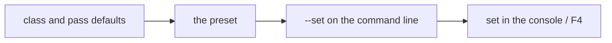

# Presets

A named set of settings: a `.preset` file is a flat pile of `"Owner.Property": value`. What it does not name keeps
its default, so a preset says only how it differs.

```json
{
    // For a machine that is mostly a heating element: less detail, a shorter view, fewer and coarser shadows.
    "Lod.Bias": 0.5,
    "Streaming.Radius": 64,
    "Assets.Budgets": { "Chunk": 512, "Texture": 256, "Model": 128 },
    "ShadowPlan.cascades": 2,
    "Gtao.steps": 2
}
```

| Preset | Id | For |
| --- | --- | --- |
| `Toaster` | 10301 | the weakest machines |
| `Normal` | 10300 | the defaults: names nothing |
| `Fancy` | 10302 | a step up |
| `MeltMyGPU` | 10303 | everything up |

## Owners

`Owner` is either a settings class or a pass.

| Owner | Class | Properties |
| --- | --- | --- |
| `Assets` | `AssetSettings` (Core) | `Budgets` (MB by asset type name), `DefaultBudget` |
| `Lod` | `LodSettings` (Core) | `Bias`: above 1 keeps detail further away |
| `Deferred` | `DeferredSettings` (DeferredRenderer) | `Scale`, `Anisotropy`, `ShaderCache`, `CullingCheck`, `PostProcessing`, `DebugView` |
| `Gpu` | `GpuSettings` (SDLRender) | `Backend`, `Vsync` |
| `Streaming` | `StreamingSettings` (Streaming) | `Radius`, `ViewDist` |
| a pass file name | the pass's `params` | `ShadowPlan.distance`, `Gtao.steps`, `Tonemap.exposure`, … |

Values are JSON: a number, `true`/`false`, a string for an enum (`"Gpu.Backend": "vulkan"`), `[x, y, z, w]` or
`[r, g, b, a]` for a vector or colour, or an object (`Assets.Budgets`). Owners and properties ignore case. A property
its settings class does not have, or a value that does not fit it, is a warning and leaves the default. The settings window (F4) and `get <Owner>` in the console list every property there is.

Any gem can add an owner: a class marked `[Settings("Name")]` with public properties and defaults. The host finds it
when the gem loads and the gem asks for it by type.

## Layers



Each layer is over the one before. Applying a preset drops what was set live but keeps `--set`. Nothing is saved:
a live change lasts until the next preset or the end of the run.

## Which preset applies

1. `--preset Presets/Toaster.preset` (or a project's preset path);
2. else the project's `"preset": { "id": N }`;
3. else `Presets/Normal.preset`.

Switch while running with `preset Toaster` in the console, or the preset list in the settings window. Changing the
GPU backend live recreates the device; everything else applies on the next frame. Editing a `.preset` file does not
re-apply it: run `preset <Name>` again.

## Adding a preset

Write `Name.preset` in `Resources/Presets/` (next id of 10300–10399) or anywhere in a project's `Assets/`, name only
what differs from the defaults, and pick it with `--preset`, the console or the project file.
