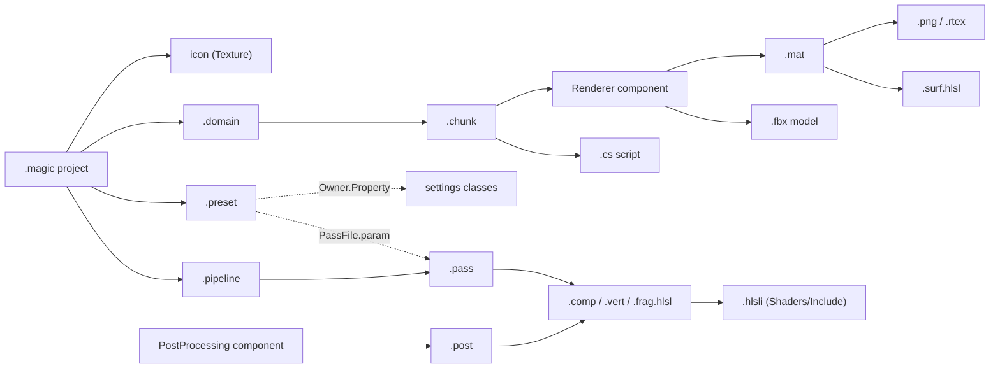

# Resources

The engine's own assets: what every project can use without shipping it. A project's assets live in its own
`Assets/` folder and work exactly the same way; this file is how any asset is found, read, kept and reloaded. Each
folder has a README for its own type.

| Folder | Type | What it is |
| --- | --- | --- |
| [Domains](Domains/README.md) | `Domain`, `Chunk` | Worlds: a `.domain` and the chunks of entities beside it. The loading screen lives here. |
| [Fonts](Fonts/README.md) | `Font` | Fonts for the debug UI. |
| [Icons](Icons/README.md) | `Texture` | The window icon. |
| [Materials](Materials/README.md) | `Material` | A surface shader with values: what a model looks like. |
| [Models](Models/README.md) | `Model` | Meshes: the primitives every project has. |
| [Passes](Passes/README.md) | `Pass`, `Post` | One GPU step each: what it reads, writes, creates and runs. |
| [Pipelines](Pipelines/README.md) | `Pipeline` | Which passes run, in which stage, in which order. |
| [Presets](Presets/README.md) | `Preset` | Named sets of settings: Toaster, Normal, Fancy, MeltMyGPU. |
| [Scripts](Scripts/README.md) | `Script` | Behaviours attached to entities in a chunk. |
| [Shaders](Shaders/README.md) | `Shader` | HLSL: surfaces, passes and the headers they share. |
| [Textures](Textures/README.md) | `Texture` | Images. |

## How they fit together



What has to agree along those arrows is in each type's README: a pass's reads and writes with its shader's
bindings, a material's params with its surface's `MaterialParams`, a chunk's component names with the C# types, a
script's id with a class of the file's name.

## Finding an asset

**Roots.** The engine indexes and watches two folders, and reads a third:

| Root | Where | Watched |
| --- | --- | --- |
| Resources | `Resources/` of the engine (the repository in a Debug build, copied next to `Magic.exe` in Release) | yes |
| Assets | `Assets/` beside the project's `.magic` file (or `--root`) | yes |
| LOD cache | `Cache/Lods/` next to `Magic.exe` | no |

Every file under a root is an asset, except `.meta` sidecars and `.md` files. A file found on two roots under the
same relative path is the first root's: Resources wins.

**Ids, not paths.** Every asset has a 64-bit id in the `.meta` beside it, and assets name each other by it:
`{ "id": 10030 }`. A file can be moved or renamed and everything that names it still finds it. Code that starts from
a name looks it up by its path relative to a root, with forward slashes: `assets.Find<Pipeline>("Pipelines/Default.pipeline")`.

**The `.meta` sidecar** is the asset class's settings, serialized:

```json
{ "id": 520, "version": 1, "origin": { "x": -1, "y": 0, "z": 0 } }
```

- `id`: unique across every root. A second file with an id already taken is refused with an error; an id of 0, or a
  sidecar that is not JSON, leaves the file unindexed.
- `version`: the sidecar format, 1.
- `lods`: authored levels of detail, `{ "<threshold>": id }`; they win over generated ones (see Models and Domains).
- Every `[MetaData]` property of the class, camelCase: `size`, `origin`, `usage`, …
- A file without a sidecar gets one on the next run, with a random id. To pick the id yourself (so it can be typed
  into other files before the first run), write the sidecar first.

**Engine id ranges.** The engine's own assets use small, readable ids: Models 512–520, Fonts 600, Domains 700–701,
Materials 710–713, Scripts 720–721, Shaders 10001–10073, Posts 10030–10031, Pipelines 10040, Passes 10100–10192,
Presets 10300–10303 (the rest are random). The samples use 3000–5999. A project's random ids never collide in
practice; anything new in `Resources/` takes the next free id of its range.

**Paths the engine names in code.** These must exist under some root:

| Path | Used for |
| --- | --- |
| `Pipelines/Default.pipeline` | The pipeline when neither `--pipeline` nor the project names one. |
| `Presets/Normal.preset` | The preset when neither `--preset` nor the project names one. |
| `Domains/Loading/Loading.domain` | The loading screen when the project names none. |
| `Icons/Mage.svg` | The window icon when the project names none. |
| `Shaders/Surfaces/Pbr.surf.hlsl`, `Shaders/Surfaces/Failure.surf.hlsl` | The default surface and the failure surface. |
| `Fonts/MontserratMedium.otf` | The debug UI's font. |
| `Models/Cube.fbx`, `Materials/Default.mat` | What `summon` puts a material on, and what it puts on a model. |

## Reading an asset

**The C# type comes from whoever asks.** A `Handle<Material>` reads the file as a `Material`; the extension only
matters where a loader says so (a shader's stage, `.post` vs `.pass`, `.rtex`, `.chunk`, `.cs`). How the file is
read is set by `[AssetFormat]` on the class:

| Format | The file is | Classes |
| --- | --- | --- |
| `Json` | the class, serialized; the sidecar's `[MetaData]` values are copied over it | `Material`, `Pass`, `Post`, `Pipeline`, `Preset`, `Domain`, `RenderTexture` |
| `Text` | text, in `Text` | `Shader` |
| `Binary` | bytes, in `Data` | `Chunk` |
| `Custom` | whatever a gem's `IAssetLoader<T>` makes of it | `Texture` (SDLImage), `Model` (AssimpModels), `Font` (SDLFonts), `Script` (CSharpScripting) |

**The JSON** (`AssetJson.Options`): camelCase keys matched case-insensitively, enums in snake_case
(`clamp_to_edge`, `rgba16_float`), vectors as `{ "x", "y", "z", "w" }`, colours as `{ "r", "g", "b", "a" }`,
handles as `{ "id": N }`, and comments and trailing commas allowed.

**Loading** is asynchronous (`Assets.LoadAsync`): the file and everything it names are read on worker threads, and a
failure is an error the caller decides what to do with. The renderer never fails a frame over one: a broken asset is
drawn with the glowing failure surface and labelled where it is (Debug builds).

## Lifetime

- **Pools.** Loaded assets are kept in one pool per type, least recently used first out. The budgets, in MB, are
  the `Assets.Budgets` setting: `Chunk` 1024, `Texture` 512, `Model` 256, anything else 32. A pool over budget is
  trimmed to 90%. A budget of 0 keeps nothing of that type. A preset can change them (`"Assets.Budgets": { "Chunk": 512 }`).
- **Core keeps no reference counts.** Whoever needs an asset to outlive the pool keeps its own reference. The
  renderer does: its tables count materials, textures, meshes and passes, and give their GPU memory back when the
  last user goes.
- **Failures are remembered** until the file (or its sidecar) changes, or the gems are rebuilt, so a broken file is
  reported once, not every frame.

## Hot reload

The watcher waits for a file to settle for 300 ms, then at the start of the next frame evicts it from its pool and
publishes `AssetAdded`, `AssetModified`, `AssetMoved` or `AssetRemoved`. A change to a `.meta` counts as a change to
its asset. Who listens:

| Type | On change |
| --- | --- |
| Shader, `.hlsli` | Everything compiled from it recompiles: material pipelines, passes. |
| Pass, Post, Pipeline | Reloaded and checked again; the frame keeps running meanwhile. |
| Material, Texture | Repacked and uploaded; materials using a texture repack. |
| Domain, Chunk | The domain reopens; a global chunk respawns; a cell chunk reloads. |
| Model | Not live: a warning says to remove and re-add its entities. |
| Script | Not from the file: rebuild the dll that compiles it (the gems reload). |
| Preset, Font | Not live: apply the preset again (`preset Name`); restart for a font. |

## Adding an asset

**To the engine** (something every project should have): put the file under the matching `Resources/` folder,
write its `.meta` with the next id of the folder's range, and read that folder's README for what it must agree with.

**To a project**: put the file anywhere under the project's `Assets/` (the samples keep each domain's materials,
textures and scripts in the domain's folder). A `.meta` is minted on the first run. The `.magic` file names the
assets the engine starts from (every value is optional; the command line's `--entry-point`, `--loading`,
`--pipeline` and `--preset` win over it):

```json
{
    "name": "Samples",
    "gems": [ "default" ],
    "entryPoint": { "id": 3301 },
    "loading": { "id": 700 },
    "pipeline": { "id": 10040 },
    "preset": { "id": 10300 },
    "icon": { "id": 7436761896624509111 }
}
```

Scripts are C#: the project's csproj compiles them (`<Compile Include="Assets\**\*.cs" />`).

**From a gem**: a gem adds asset *types*, not files. It can declare an `Asset` subclass (found through
`IRegisterFromGem<Asset>`), an `IAssetLoader<T>` for a file format, an `ILODGenerator<T>` and a budget name. The
files themselves live in `Resources/` or a project's `Assets/`: there is no gem asset folder.
